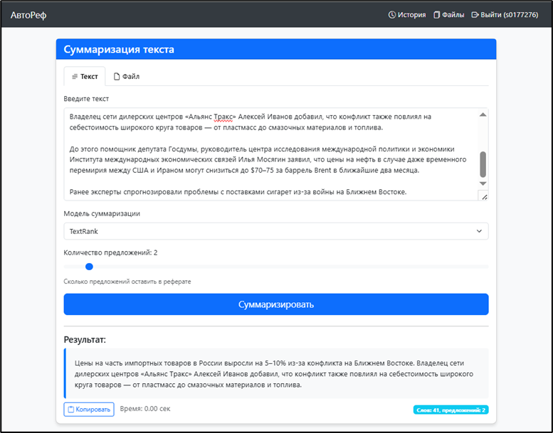
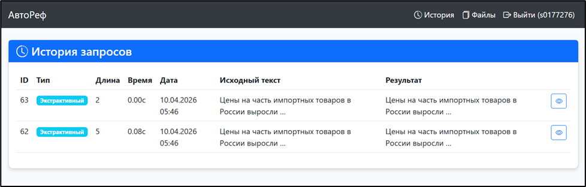

**АвтоРеф** — интеллектуальный веб-сервис для автоматической суммаризации текстов.
Генерируйте краткие рефераты, загружайте файлы и анализируйте результаты.

## 🚀 Возможности
- Суммаризация текста с использованием экстрактивных методов (TextRank, LSA, LexRank)
- Суммаризация текста с использованием нейросетевых моделей (ruT5, mBART)
- Загрузка файлов в форматах .txt, .pdf, .docx
- Регистрация и личный кабинет с историей запросов
- Сохранение, просмотр и копирование полученных рефератов

## ⚙️ Инструкция по запуску

1. Склонируйте код с репозитория
`git clone https://github.com/nikitafilipenko2/Thesis.git`
2. Откройте проект в среде разработки, например PyCharm.
3. Установите зависимости из requirements.txt.
`pip install -r requirements.txt`
4. Выполните миграцию бд.
`python manage.py migrate`
4. Запустите приложение командой python manage.py runserver.
`python manage.py runserver`
6. Откройте в браузере веб-приложение по адресу http://127.0.0.1:8000
