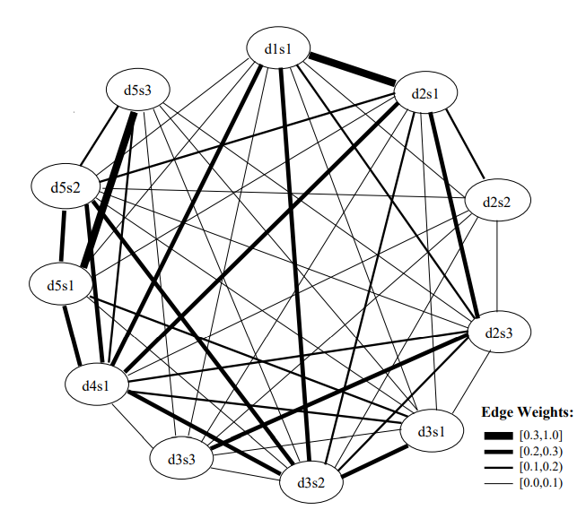
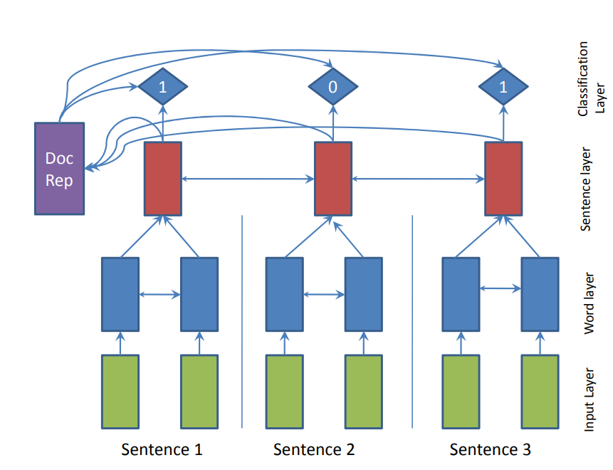
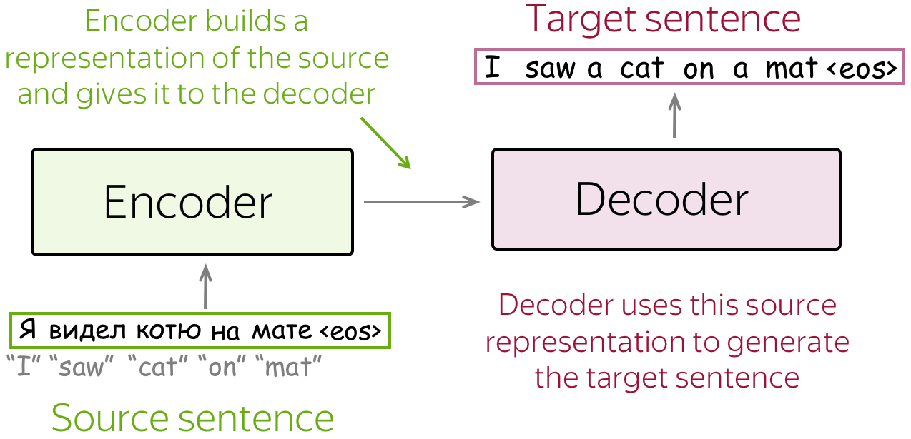
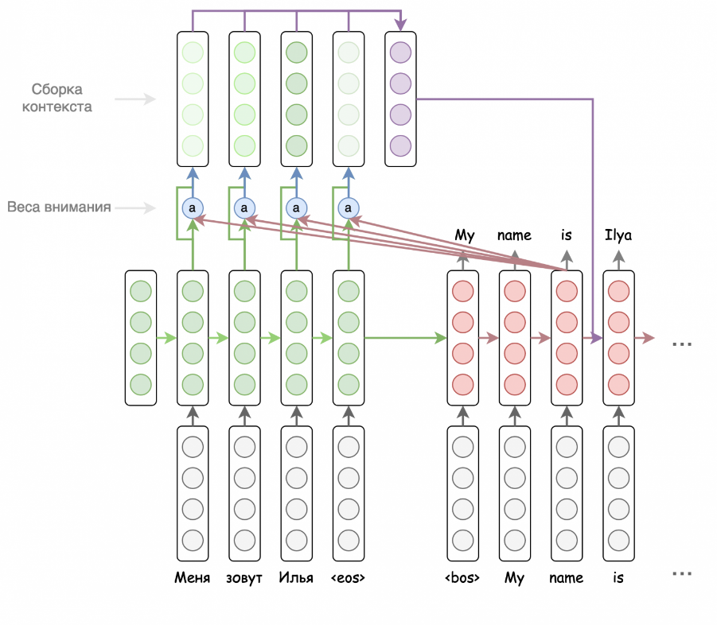
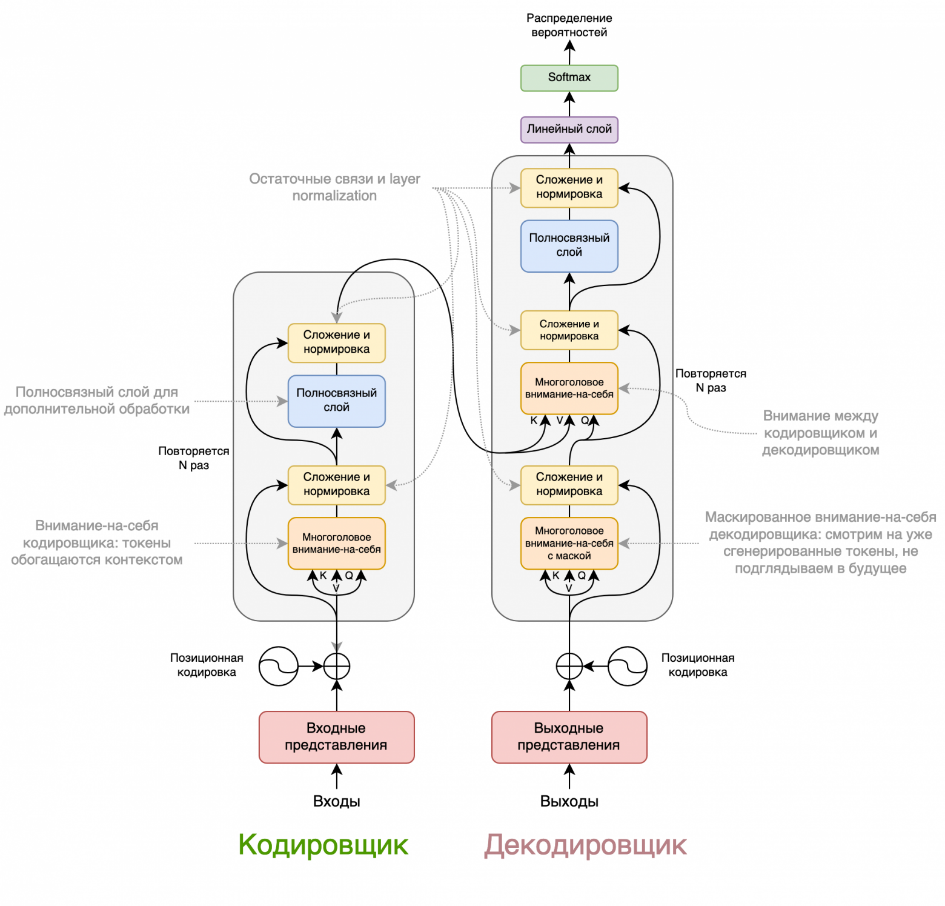
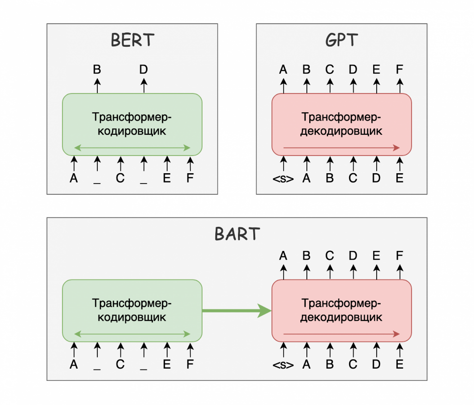

МИНИСТЕРСТВО НАУКИ И ВЫСШЕГО ОБРАЗОВАНИЯ РОССИЙСКОЙ ФЕДЕРАЦИИ

Федеральное государственное бюджетное образовательное учреждение

высшего образования

**«КУБАНСКИЙ ГОСУДАРСТВЕННЫЙ УНИВЕРСИТЕТ»**

**(ФГБОУ ВО «КубГУ»)**

**Факультет компьютерных технологий и прикладной математики**

**Кафедра информационных технологий**

> Допустить к защите
>
> Заведующий кафедрой
>
> канд. техн. наук, доц.
>
> \_\_\_\_\_\_\_\_\_ В.В. Подколзин
>
> (подпись)
>
> \_\_\_\_\_\_\_\_\_\_\_\_\_\_\_\_ 2025 г.

**ВЫПУСКНАЯ КВАЛИФИКАЦИОННАЯ РАБОТА**

**(БАКАЛАВРСКАЯ РАБОТА)**

**АВТОМАТИЗИРОВАННАЯ ГЕНЕРАЦИЯ РЕФЕРАТИВНЫХ ТЕКСТОВ НА ОСНОВЕ МОДЕЛЕЙ
ИСКУССТВЕННОГО ИНТЕЛЛЕКТА**

Работу выполнил
\_\_\_\_\_\_\_\_\_\_\_\_\_\_\_\_\_\_\_\_\_\_\_\_\_\_\_\_\_\_\_\_\_\_\_\_\_Н.
С. Филипенко

(подпись)

Направление подготовки [02.03.03 Математическое обеспечение и
администрирование информационных систем]{.underline}

(код, наименование)

Направленность (профиль[) Технологии программирования]{.underline}

Научный руководитель

канд. пед. наук, доц.
\_\_\_\_\_\_\_\_\_\_\_\_\_\_\_\_\_\_\_\_\_\_\_\_\_\_\_\_\_\_\_Н. Ю.
Добровольская

(подпись)

Нормоконтролер

канд. пед. наук, доц.
\_\_\_\_\_\_\_\_\_\_\_\_\_\_\_\_\_\_\_\_\_\_\_\_\_\_\_\_\_\_\_\_\_\_\_\_\_\_\_\_\_
А. В. Харченко

(подпись)

Краснодар

2025

**СОДЕРЖАНИЕ**

#  {#section .TOC-Heading}

[Введение [3](#введение)](#введение)

[1 Обзор современных исследований задачи автоматического реферирования
[4](#обзор-современных-исследований-задачи-автоматического-реферирования)](#обзор-современных-исследований-задачи-автоматического-реферирования)

[1.1 Современные тенденции автоматизированной генерации реферативных
текстов
[4](#современные-тенденции-автоматизированной-генерации-реферативных-текстов)](#современные-тенденции-автоматизированной-генерации-реферативных-текстов)

[1.2 Основые этапы подготовки текстов
[7](#основные-этапы-подготовки-текстов)](#основные-этапы-подготовки-текстов)

[1.3 Обзор моделей и методов [8](#_Toc212799523)](#_Toc212799523)

[1.3.1 Экстрактивные методы реферирования текстов
[8](#экстрактивные-методы-реферирования-текстов)](#экстрактивные-методы-реферирования-текстов)

[1.3.2 Абстрактивные методы реферирования текстов
[14](#абстрактивные-методы-реферирования-текстов)](#абстрактивные-методы-реферирования-текстов)

[1.4 Критерии оценки качества реферативных текстов
[20](#_Toc212799526)](#_Toc212799526)

[2 Задача суммаризации на основе научных статей
[23](#задача-суммаризации-на-основе-научных-статей)](#задача-суммаризации-на-основе-научных-статей)

[2.1 Требования к структуре рефератов научных статей в соответствии с
ГОСТ
[23](#требования-к-структуре-рефератов-научных-статей-в-соответствии-с-гост)](#требования-к-структуре-рефератов-научных-статей-в-соответствии-с-гост)

[2.2 Программные решения для автоматического реферирования
[25](#некоторые-программные-решения-для-автоматического-реферирования)](#некоторые-программные-решения-для-автоматического-реферирования)

[6 Описание GPT-активностей
[28](#описание-gpt-активностей)](#описание-gpt-активностей)

[Список использованных источников
[30](#список-использованных-источников)](#список-использованных-источников)

#  ВВЕДЕНИЕ

Потребность в реферировании значительно возросла с экспоненциальным
ростом объема текстовых данных, поэтому автоматическая суммаризация
текста -- важная и актуальная задача в сфере обработке естественного
языка, направленная на создание краткого и содержательного представления
более длинного исходного текста. На основе текстов сгенерированных
рефератов реферирование можно разделить на два типа: экстрактивное и
абстрактное. В экстрактивном реферировании сгенерированный реферат
состоит из слов и предложений, непосредственно извлеченных из исходного
текста, тогда как в абстрактном реферировании краткий реферат содержит
ключевые концепции исходного текста в новом сгенерированном тексте.
Сгенерированный реферат потенциально включает фразы и предложения,
отсутствующие в исходном тексте.

**\
**

# 1 Обзор современных исследований задачи автоматического реферирования

## **1.1 Современные тенденции автоматизированной генерации реферативных текстов**

На данный момент существует достаточно большое количество отечественных
и зарубежных статей на тему автоматического реферирования текстов,
которые говорят о важности решаемой задачи, когда объемы и количество
текстов растут и это приводит к трудностям в работе специалистов
\[1-6\].

В своем исследовании С. Г. Сорокина представляет глубокий анализ
различных подходов к проблеме, говоря о том, что автореферирование
становится необходимым инструментом для науки, образования, бизнеса,
медицины и множества других областей, так как позволяет быстрее понимать
суть и ключевые мысли текстов. Также они выделяют различные
классификации рефератов и методы их построения. Так, авторы говорят о
недостатках подходов: экстрактивный текст может выглядеть как набор
предложений и быть не связан, тогда как абстрактивный текст хоть и похож
на написанный человеком, но может содержать в себе искажения. При
проведении сравнений при помощи традиционных метрик, таких как ROUGE,
BLEU, METEOR авторы говорят о превосходстве гибридных методов \[1\].

Работа Ю.В. Медяник и Л.А. Сабировой посвящена анализу экстрактивных
методов автосуммаризации для работы с научными статьями. Так, авторы на
основе структуры научный работы: аннотация, введение, обзор литературы,
методология, результаты, обсуждение и выводы, делают вывод о
необходимости использования основной информации из разделов с наиболее
высокой практической значимостью текста, то есть из разделов, где
обсуждаются используемые методы и общие результаты статьи. Авторы
проводят обзор извлекающих методов и после их анализа останавливаются на
использовании статистический TF-IDF для быстрой фильтрации важных
терминов и графовый TextRank для общей связной структуры текста. В
результатах работы авторы говорят о 20-30 процентном улучшении метрик по
сравнению со стандартными методами \[2\].

Напротив, в своем исследовании Д. В. Мельничук и А. В. Носкина проводят
сравнение различных NLP-моделей применимо к задаче автореферирования
научных текстов на русском языке. Так они исследуют предобученные модели
с архитектурой трансформер с генерирующим подходом к проблеме. В работе
сравниваются 3 модели, для которых ставится задача генерация аннотация
на основе текста статьи и дальнейшем сравнении с аннотацией автора.
Модели mBART, T5, GPT-3 авторы работы предобучают на корпусе Gazeta Ильи
Гусева, составленном из заголовком новостных статей с их содержанием, а
для непосредственного fine-tuning собран датасет из 825 статей с сайта
КиберЛенинка. По результатам исследования по большинству метрик лидирует
T5, но в общем авторы выделяют слабости моделей в терминологии, что они
связывают с направлением корпуса для предобучения \[3\].

В этом же направлении исследования можно выделить статью под авторством
А.Е. Дагаева и Д.И. Попова, в которой они также проводят анализ
эффективности современных моделей для генерации краткого содержания
текстов на русском языке GigaChat, YaGPT2, ChatGPT-3.5, ChatGPT-4.
Авторы работы проводят сравнение с предобучением на таких корпусах, как
Gazeta, XL-Sum, WikiLingua. В конце авторы приводят сравнение с помощью
стандартных метрик, а также вводят свою, являющуюся взвешенной суммой
ранее упомянутых метрик с учетом степени сжатия текста. Авторы отмечают
превосходство GigaChat для текстов на русском языке, но отмечают такие
же проблемы, как и авторы статьи выше: разная предметная область
обучающих корпусов и непосредственных текстов выливается в не очень
глубокий по терминам реферат. Также, как и в предыдущей статье авторы
отмечают отсутствие экспертной оценки реферативных текстов, что также
может нести проблему \[4\].

В работе же К.В. Ребенка проводится исследование различных архитектур и
подходов по отношению к проблеме и их применимость к задаче на русском
языке. Так авторы исследуют рекуррентные нейронные сети и трансформеры,
которые подходят для обработки длинных последовательностей, а также
TextRank. В результате исследования авторы делают вывод о том, что
трансформер превосходит сети с долгой кратковременной памятью по метрике
ROUGE-1, из-за того, что трансформер использует механизм внимания. При
этом проводится экспертная оценка 50 текстов и выделяется такие
известные проблемы, как склонность к галюцинация у моделей с
архитектурой BERT, потеря точности и терминов по сравнению с
оригинальным текстом у GPT, отсутсвие общей связности у TextRank.
Авторы, говоря о перспективах, отмечают использование специфического по
области и большего по объему корпуса, развитие гибридных методов и
использование мультимодальных подходов для извлечения информации не
только из текста, но и из изображений, таблиц и графиков \[5\].

Проблема отсутствия обучающих корпусов прослеживаются не только на
русском, но и на многих других языках. Так в своем исследовании Mehmet
Samet Duran и Tevfik Aytekin этому аспекту выделена ключевая роль и
разработана система с учетом лингвистических особенностей турецкого
языка. Модель авторов предобучена на mBART с учетом метрики,
разработанной специально для турецкого языка, и собранного датасета с
выделением уровня подготовленности читателя. Такая архитектура
показывает выигрыш до 10 процентов по классическим метрикам по сравнению
с обычными архитектурами, основанными на трансформерах. Не смотря на
успехи модель не оценивается экспертными, поэтому сложно понять реальную
эффективность модели, из-за вычисления отклонения от разработанной
метрики обучение вычислительно затратно, а в целом обучение усложнено
явлением агглютинации в турецком языке. Но авторы отмечают ценность
подхода в других низкоресурных языках \[7\].

Таким образом, исследования показывают, что переход к абстрактивным
сложным методам на основе трансформеров обоснован и они показывают
лучшие результаты, чем извлекающие методы. Тем не менее необходимо
выбирать подходы, методы и метрики, подходящие конкретному языку, задаче
или области. Общей проблемой является отсутствие датасетов и обучающих
корпусов для конкретной проблемы, вычислительная сложность и
необходимость проверки экспертами готового реферата, так как метрика не
может установить, насколько текст удобен и читабелен для человека
\[1-5,7\].

## **1.2 Основные этапы подготовки текстов**

С.Г. Сорокина в своем исследовании проводит подробный обзор сервисов,
методов и приемов автоматического реферирования \[1\]. Кроме того,
говорит о том, что для продуктивного процесса как реферирования, так и
других задач обработки естественного языка, таких как машинный перевод,
анализ тональности и т.д., необходимо провести предобработку исходных
данных, которая может состоять из таких этапов, как:

-   очистка текста от несущественных элементов, таких как нумерация,
    излишняя табуляция, изображения, знаки препинания;

-   перевод всех букв в единый регистр для исключения ситуации принятия
    их за разные слова;

-   обнаружение и удаление стоп-слов (имеющих частое появление, но не
    несущих смысла для всего текста в целом);

-   процесс токенизации или разбиения текста на отдельные лексические
    единицы (слова, словосочетания и предложения);

-   процесс лемматизации или приведение слова к его нормальной
    словоформе (например, «ложками» переводит в «ложки»);

-   процесс стеминга или приведение слова к его корневой форме за счет
    отбрасывания морфем (например, «строители» переводит в «строит»);

-   добавление структуры текста в качестве метатегов или заголовков для
    понимания алгоритмом.

[]{#_Toc212799523 .anchor}**1.3 Обзор моделей и методов**

В зависимости от поставленной задачи, применяемых методов, способов
обработки, предназначения реферата выделяют основные виды реферирования:
экстрактивное и абстрактивное.

Экстрактивное реферирование характеризуется формированием нового текста
из фрагментов (фраз, предложений, абзацев) исходного документа. Итоговый
реферат не содержит других элементов, кроме тех, которые встречались в
исходном тексте.

Так, в работе \[2\] выделяются и анализируются наиболее широко
используемые методы экстрактивного, среди которых выделяют
статистические (Метод Луна, TF-IDF, LSA) и графовые (TextRank, LexRank),
которые не нуждаются в эталонных рефератах и не привязаны к определенной
предметной области, что делает их быстрее и проще, и методы на основе
машинного обучения для обработки последовательностей, использующие
рекуррентные нейронные сети или модели, использующие архитектуру
Transformer. Рассмотри подробнее каждый из них далее.

### **1.3.1 Экстрактивные методы реферирования текстов**

Рассмотрим методы, которые вычисляют последовательно важность
предложений, являющиеся чисто статистическими.

Первым из методов реферирования считается метод Луна, появившийся в 1958
году и состоящий в следующей последовательности шагов \[11\]

Проводим стемминг или лемматизацию слов, чтобы разные словоформы одного
слова могли считаться одним и тем же. Затем считаем частоты слов,
формируем их список по убыванию. Убираем стоп-слова: часто встречающиеся
слова, у которых нет самостоятельной смысловой нагрузки, такие как
предлоги, союзы, частицы. Убираем слишком редкие слова, например такие,
которые встречаются только 1 раз, либо убираем какой-то нижний
перцентиль слов по частоте. Все оставшиеся слова считаем значимыми.

Далее предложение делим на промежутки, которые начинаются и
заканчиваются значимыми словами. В промежутке могут встретиться и
незначимые слова, но не более 4 подряд. Важность промежутка вычисляется,
как квадрат количества значимых слов в промежутке, делённый на размер
промежутка. Значимость предложения представляет собой максимум из
важностей промежутков. Берём в качестве реферата предложения со
значимостью выше определённого установленного порога.

{width="4.013888888888889in"
height="1.6104472878390201in"}

Рисунок 1 -- Графическое представление работы метода

Существует множество методов, не только для задачи реферирования, в
основе которых лежит статистическая мера TF-IDF (Term Frequency --
Inverse Document Frequency), которая имеет предназначение для вычисления
значимости слов в конкретном контексте путем учета их частотности по
сравнению с их встречаемостью во всем корпусе.

TF ‒ это частота встречаемости слова в документе, которая показывает
значимость слова в тексте:

$$TF(t,d) = \frac{n_{t}}{\sum_{k}^{}n_{k}}\ \ (1)$$

где $n_{t}$ -- количество употреблений терма t в документе, а в
знаменателе -- общее количество слов в документе.

IDF отвечает за уникальность слова среди всех анализируемых документов:

$$IDF(t,D) = log\frac{|D|}{|\left\{ d_{i} \in D\  \right|\ t\  \in d_{i}\}|}\ (2)$$

где $|D|$ -- количество документов, а в знаменателе -- общее количество
документов, содержащих терм t.

Если слово часто встречается в конкретном документе, его вес будет
большим относительно других единиц в этом тексте. Напротив, вес слова
будет небольшим, если оно встречается во многих документах.
Соответственно, словам, которые встречаются в большом количестве
документов, присваивается низкое значение IDF, так как они не имеют
высокой значимости. При суммаризации методом на основе TF-IDF важность
предложений для дальнейшего составления резюме рассчитывается как сумма
важностей отдельных слов внутри каждого предложения. Чем больше
получившееся число, тем значимее предложение. Конечный текст формируется
из предложений с наивысшими баллами.

Графовые методы, такие как TextRank, представляют текст как граф, где
вершины являются предложениями или словами, а ребра ‒ связями между ними
(например, совпадение слов или семантическая близость).

Таким образом общий порядок алгоритма имеет следующий вид.

-   определение лексических единиц (слов или предложений) и внесение их
    в граф как вершины;

-   определение связи по формуле (3) между этими вершинами (посредством
    непосредственной близости в тексте или семантической близости) и
    построение ребер графа:

$${sim}_{ij} = \frac{|\{ w|(w\  \in \ S_{i}) \cap (w\  \in \ S_{j})\}|}{\log{(|S_{i}|)} + \ \log{(|S_{j}|)}}\ (3)$$

где w -- слово, $S_{i}$ набор слов i-го предложения, а $S_{j}$ --- набор
слов j-го предложения.

-   посредством алгоритма ранжирования строятся веса (pagerank) до тех
    пор, пока изменения не станут незначительными:

$$P\left( S_{i} \right) = \frac{(1 - d)}{|S|} + d(\sum_{S_{j}}^{}{\frac{{sim}_{ij}}{\sum_{S_{k}}^{}{sim}_{kj}}P(S_{j}))}\ (4)$$

где $P\left( S_{i} \right)\ $-- PageRank i-го предложения,
 ${sim}_{ij}\ $--- схожесть $S_{i}$  и $S_{j}$,  $|S|$--- мощность
множества всех предложений, d --- коэффициент демпфирования.

-   далее вершины сортируются в порядке убывания и предложения с
    наивысшими оценками выбираются для реферата.

Улучшением алгоритма метода TextRank является LexRank, который получает
выигрыш за счет использования модификации TF-IDF и вычисления меры
схожести на ее основе \[11\]. Это позволяет меньше учитывать часто
встречающиеся слова, которые скорее относятся к общим, несущих меньше
информации, чем термины, а на сами специальные термины обращать больше
внимания \[2\].

Схожесть предложений в этом случае определяется по формулам ниже.

$${tf}_{w}^{i} = \frac{|\{ w_{k}|(w_{k} \in \ S_{i}) \cap (w_{k} = w)\}|}{|S_{i}|}\ (5)$$

$${idf}_{w} = log\frac{|S|}{|\left\{ S_{i}\  \right|\ w\  \in S_{i}\}|}\ (6)$$

$${sim}_{ij} = \frac{\sum_{w\  \in {(S}_{i} \cup S_{j}\ )}^{}{{tf}_{w}^{i}{tf}_{w}^{j}{({idf}_{w}}^{2})}}{\sqrt{\sum_{w\  \in {\ S}_{i}}^{}{({tf}_{w}^{i}{{idf}_{w})}^{2}}}\sqrt{\sum_{w\  \in {\ S}_{j}}^{}{({tf}_{w}^{j}{{idf}_{w})}^{2}}}}\ (7)$$

Пример итоговой матрицы схожести представлен на рисунке 2.

{width="4.272594050743657in"
height="3.7231036745406825in"}

Рисунок 2 -- Граф схожести

Во всех этих методах мы не учитываем темы, из которых состоит исходный
текст. Для решения этой проблемы можно использовать метод
латентно-семантического анализа, который основывается на разложение
исходной матрицы инцидентности из слов и предложений на три отдельные
матрицы по формуле ниже.

$$A = USV^{T}\ (8)$$

где S - диагональная матрица с неотрицательными элементами, у которой
элементы, лежащие на диагонали --- это сингулярные числа, а матрицы U и
V --- это матрицы, состоящие из левых и правых сингулярных векторов
соответственно.

Кроме того, i-тый столбец третьей матрицы соответствует i-тому
предложению, а его компоненты -- величине важности одной из тематик в
этом предложении, а элементы средней матрицы -- значимости этой
тематики. То есть k-тый сингулярный вектор матрицы $V^{T}$ соответсвует
теме k и при взятии максимальное значение из этого столбцы мы получим
лучшее предложение по этой теме.

В итоге мы оставляем установленное количество самых важных тематик и на
их основе берем самые подходящие предложения по этим темам \[11\].

Не смотря на всю привлекательность и легкость методов без обучающих
примеров, более точное представление краткого содержания даю методы на
основе нейронных сетей, которые мы рассмотрим далее.

Одним из первых является метод SummaRuNNer, представляющий собой по
архитектуре двунаправленную рекуррентную сеть на основе GRU, первое
направление которой проходится по отдельным словам, а второй -- по всем
предложениям. Общая архитектура показана на рисунке 3 \[12\].

{width="3.1230708661417323in"
height="2.393886701662292in"}

Рисунок 3 -- Архитектура SummaRuNNer

Алгоритм метода в целом представляет собой бинарную классификацию на
вопрос включения предложения в реферат. Определяется это решение
схожестью предложения на исходный текст на основании какой-либо оценки
или метрики, например ROUGE, BLEU или METEOR.

### **1.3.2 Абстрактивные методы реферирования текстов**

В противовес рассмотренным выше экстрактивным методам можно также
привести наиболее актуальные в данный момент времени абстрактивные или
генерирующие методы решения задачи составления реферативных текстов. При
этом подходе текст на выходе получается похож на человеческий: выглядит
связно и синтаксически последовательно. И методы с помощью, которых он
составляется тоже похожи на рассуждения и методы человека при написании
краткого содержания. Так нейронная сеть заменяет похожие понятия на
синонимы, упрощает предложения и термины, обобщает абзацы предложениями,
которые рассказывают, о чем будет абзац, из начала и фразами в конце
абзаца, подводящие некий промежуточный итог \[13\].

Так, одним из первых значимых подходов к задаче абстрактивного
реферирования стал Sequence-to-sequence(Seq2seq). Его суть заключается в
переводе одной последовательности токенов в другую и изначально Seq2seq
был придуман для перевода. Применимо к задаче суммаризации -- перевод
токенов исходного текста в выходные токена реферата. Стандартным в этом
подходе является разделение на кодировщик и декодировщик. Так кодировщик
читает входной текст и создает его представление в виде токенов x, а
декодировщик на их основании генерирует выходной текст y. Пример
представлен на рисунке 4 \[14\].

{width="3.9in"
height="1.8828740157480315in"}

Рисунок 4 -- Пример работы Seq2seq

Работает декодировщик, как предсказатель следующего токена на основе
предыдущих сгенерированнных слов $y_{t}$ и вектора из кодировщика x,
вычисляя вероятности появления по формуле 9.

$$P\left( y_{1},y_{1},\ldots,y_{n} \middle| x \right) = \prod_{t = 1}^{n}{p\left( y_{t} \middle| y_{< t},x \right)\ (9)}$$

Наиболее простая модель на основе кодировщика и декодировщика состоит из
двух рекурентных нейронных сетей на основе LSTM. В этой модели последнее
скрытое состояние кодировщика становилось первым скрытым состоянием
декодировщика. При обучении модели при этом применялось функция потерь в
виде кросс-энтропии нужного распределения вероятностей p\* и полученными
вероятностями p (формула 10).

$$Loss\left( p^{*},p \right) = - \log\left( p_{y_{t}} \right)(10)$$

Проблема такого подхода заключается в том, что кодировщик делает только
одно представление текста, что модель может забыть что-то важное. Это
становится проблемой и для декодировщика, которому могут понадобиться
разные части текста в разные моменты времени.

Для решения этой задачи была введена новый механизм, получивший название
механизм внимания. На каждом шаге нейронной сети с использованием
внимания, декодировщик решает какая часть наиболее важная, а кодировщику
больше не нужно сжимать целый текст в один вектор, теперь он строит
представления для всех токенов. Таким образом, работу декодирощика можно
описать в следующих шагах:

-   получаает состояние декодировщика и все состояния кодировщика;

-   вычисляет оценку внимания на основании их релевантности для
    нынешнего состояния декодировщика;

-   вычисляет веса внимания помощью функции softmax;

-   считает взвешенную суму состояний кодировщика \[14\].

Пример работы такого подхода показан на рисунке 5.

{width="4.091666666666667in"
height="3.569382108486439in"}

Рисунок 5 -- Механизм внимания

В настоящее время стандартом для задач превращения последовательности в
другую последовательность является подход, основанный только на
механизме внимания, под названием трансформер. Помимо более высокого
качества, модель на его основе обучается на порядки быстрее.

Механизмы работы кодировщика и декодировщика также отличаются от
предыдущих примеров. Так, кодировщик повторяет некоторое число раз
просмотр всех токенов друг на друга и обновление их представлений, а
декодировщик это же число раз смотрим на предыдущие получившиеся и
исходные токены и обновляет их представления.

Одним из важных компонентов модели также является самовнимание.
Заключается оно в просматривании в каждом из состояний других состояний,
относящихся к этому же шагу. То есть каждый токен, смотрим на другие
токены в предложении, собирает данные и обновляется свои представления.
При этом токен получается три представления: запрос, ключ и значение.
Далее внимание вычисляется по формуле 11.

$$Attention(q,k,v) = softmax\left( \frac{qk^{T}}{\sqrt{d^{k}}} \right)v\ (11)$$

В случае же самовнимания декодировщика маскируются будущие токены за
следующим, что позволяет декодировщику наблюдать только за предыдущими.

Также важен механизм многоголового внимания, позволяющий понимать
отношение отдельного слова в других частях предложения. Считается такое
внимание как соединение разных голов, головы же в свою очередь
вычисляются как внимание отдельных слов. Итоговая архитектура
представлена на рисунке 6.

{width="4.269932195975503in"
height="4.092361111111111in"}

Рисунок 6 - Трансформер

Одной из наиболее популярной архитектурой для решения задач обработки
естественного языка является BERT (Bidirectional Encoder Representations
from Transformers), ее отличием от других является понимание текста как
слева, так и справа от слова, что делает модель лучше понимающей связи
между словами. Тренируется модель на двух задачах: восстановлении
замаскированных слов, так, например, модель должна восстановить текст,
где пропущены 15% слов текста, и предсказывания порядка двух предложений
для понимания логической связи или ее отсутствии \[14\].

Существует множество специальных моделей на основе архитектуры
трансформер для решения задачи абстрактивного автоматического
реферирования. Рассмотрим их далее.

Модель BertSumAbs на основе Bert создает новый текст в
sequence-to-sequence подходе. В качестве кодировщика используется
трансформер из 6 слоев \[13\].

Семейство моделей GPT основано на предобучении предсказания следующего
идущего слова в тексте слева направо. Конкретно для задачи составления
реферата текста обучающий реферат разделяются с помощью некоторого
символа, а затем модель пробует создать реферат на основе текста,
который она встретила ранее. Для русского языка компанией Сбербанк было
создано семейство моделей ruGPT.

Также следует отметить модель на основе sequence-to-sequence
трансформера BART, созданную компанией Facebook, которая обучалась на
восстановлении оригинала испорченного зашумленного замаскированного
текста. В тексте маскируются или удаляются отдельные токены, случайно
сортируются предложения, а некоторые группы слов маскируются как один
токен. Ее особенностью является использование как кодировщика, так и
декодировщика. Различие показаны на рисунке 7.

{width="4.375in"
height="3.735635389326334in"}

Рисунок 7 -- Различия моделей BERT, GPT и BART

Компанией Google также представлен своя архитектура на основе
sequence-to-sequence трансформер под названием T5(Text-to-Text Transfer
Transformer). Модель при обучении решала проблема заполнения пропусков
целых кусков предложения.

Существует также модель PEGASUS, созданная специально для задачи
генеративного реферирования. Ее же задачей при обучении являлась
создание пропущенных предложений. При этом каким-либо образом выбирались
предложения для составления экстрактивного реферата, затем они
удалялись, а модели предлагалось их сгенерировать \[13\].

[]{#_Toc212799526 .anchor}**1.4 Критерии оценки качества реферативных
текстов**

Для оценки различных параметров полученного реферата используется
множество метрик, которые дают некоторую оценку тексту на основе
исходного. Это может быть качество, читаемость, последовательность
изложения, общая связность и т.д. В настоящее время такие количественные
меры оценки можно разделить на традиционные (ROUGE, BLEU, METEOR) и
нейросетевые(BERTScore, BLEURT). Рассмотрим конкретные примеры далее
\[1\].

Самой используемой является метрикой ROUGE и его разновидности.

Она была создана как раз для оценки качества реферата. Так, ROUGE-1
считает количество совпадения отдельных слов(униграм) в реферате и
оригинальном текста, ROUGE-2 количество комбинаций из стоящих вместе
двух слов(би-грам), ROUGE-3 - для трех соответственно и т.д. Также
выделяется ROUGE-L, которая оценивает схожесть на основе самой длинной
последовательности слов. Представим ниже формулы для расчетов на примере
ROUGE-2.

$${ROUGE\_ 1}_{recall} = \frac{Число\ одинаковых\ комбинаций\ из\ 2х\ слов\ }{Их\ число\ в\ исходном\ тексте}\ (12)$$

$${ROUGE\_ 1}_{presicion} = \frac{Число\ одинаковых\ комбинаций\ из\ 2х\ слов\ }{Их\ число\ в\ реферате}\ (13)$$

$${ROUGE\_ 1}_{F1 - score} = 2\frac{precision*recall\ }{precision + recall}\ (14)$$

Далее стоит рассмотреть BLEU (BiLingual Evaluation Understudy). Она
считает количество совпадений для отдельных слов и словосочетаний. Потом
это число делится на общее число слов и словосочетаний в получившемся
переводе - получается precision. К итоговому precision применяется
корректировка - штраф за краткость (brevity penalty), чтобы избежать
слишком высоких оценок BLEU для кратких и неполных переводов. Приведем
формулы для словосочетаний длины до четырех слов.

$$BLEU = BP*exp(\frac{1}{4}\sum_{i = 1}^{4}{ln(p_{i}))\ (15)}$$

где BP = 1, если длина получившегося реферата больше эталонного, иначе
$BP = exp(1 - \frac{длина_{эталонного_{реферата}}}{длина_{сгенерированного_{реферата}}})$,
$p_{i}\ $- длина n-грамы из i слов.

Проблемой данных оценок состоит в необходимости полного совпадения слов,
что в случае генерирующего реферирования или машинного перевода нечасто,
а порой и невозможно.

METEOR (Metric for Evaluation of Translation with Explicit ORdering)
учитывает однокоренные слова и синонимы. Рассчитывается с учетом
наказания за закучкованность.

$$METEOR = 10\frac{precision*recall\ }{precision + 9*recall}\left( 1 - w\left( \frac{ch}{m} \right)^{3} \right)(16)$$

где precision и recall рассчитываются аналогично ROUGE, ch - число
последовательных совпадений, m - число сопоставленных вместе униграм
\[6\].

На основании BERT также создана метрика BERTScore, которая способна
определять глубокие связи с помощью векторных представлений слов. После
этого определяется их схожесть на основании косинуса угла между ними.
Аналогично прошлым методам строится precision, recall и F1-Score.

Так, выбирать метрику стоит в зависимости от представленной задачи,
например, для простой оценки точности ROUGE и BLEU, а для семантической
близости следует использовать METEOR и BERTScore \[8\].

# 2 Задача суммаризации на основе научных статей

## **2.1 Требования к структуре рефератов научных статей в соответствии с ГОСТ**

Согласно ГОСТУ Р7.0.7--2021 статья в сборнике или научном журнале должна
содержать следующие элементы издательского оформления:

-- сведения об издании, в котором опубликована статья;

-- название рубрики или раздела издания;

-- тип статьи;

-- индекс Универсальной десятичной классификации (УДК);

-- цифровой идентификатор объекта (Digital Object Identifier -- DOI);

-- заглавие статьи;

-- подзаголовочные данные статьи;

-- сведения об авторе (авторах);

-- аннотация (резюме);

-- ключевые слова (словосочетания);

-- благодарности;

-- знак охраны авторского права;

-- перечень затекстовых библиографических ссылок;

-- сведения о продолжении или окончании статьи;

-- приложение (приложения);

-- примечания;

-- дата поступления рукописи в редакцию издания, дата одобрения после
рецензирования, дата принятия статьи к опубликованию \[9\].

Здесь стоит сосредоточиться на элементе аннотация или резюме, что
является синонимом реферата. Так, необходимо рассмотреть предлагаемые к
нему требования, которые подробно описаны в ГОСТ Р 7.0.99-2018 \[10\].

Под рефератом авторы подразумевают краткое точное изложение содержания
первичного документа в текстовой форме, включающее основные фактические
сведения и выводы, без дополнительной интерпретации или критических
замечаний автора реферата.

При этом приводится несколько классификаций по разным аспектам самого
резюме. Так, например, по форме изложения выделяют:

-   информативный реферат: реферат, отражающий в обобщенном виде все
    основные положения первичного документа.

-   индикативный реферат: краткий реферат, отражающий основные темы и
    вид первичного документа

-   информативно-индикативный реферат: комбинированный реферат,
    отражающий в сокращенном виде основные положения и аспекты
    первичного документа.

Таким образом, авторы указывают, что информативный реферат должен иметь
цель работы, методологию проведения работы, а индикативный - вид, форму
документа. Оба вида обязаны содержать предмет, тему работы, результата,
их область применения и выводы. Рекомендовано использовать информативный
для основных фактов работы и для документов, которые могут описывать
результаты экспериментов, а индикативный -- при анализе обзоров, которые
можно по содержанию причислить ко многим предметным областям.
Рекомендуемый средний объем текста реферата -- 850 печатных знаков.

А по составителю краткого содержания научной работы:

-   авторский реферат (автореферат): реферат, составленный автором
    первичного документа.

-   неавторский реферат: реферат, составленный референтом.

-   машинный (автоматический) реферат: реферат, составленный с помощью
    компьютерной программы.

-   аннотация: краткая характеристика первичного документа с точки
    зрения его назначения, содержания, вида, формы и других
    особенностей.

Аннотация должна в себя включать при этом сведения о содержании работы,
его авторах, типе документа, основной теме, проблемах, объекте, цели
работы и ее результатах, новизне и достоинствах документа, его научном и
практическом значении для целевой аудитории.

Авторы также приводят свою точку зрения по методологии составления
реферата, давая конкретные шаги и четко разделяя этапы проведения
анализа работы.

Текст самого краткого содержания не должен субъективную оценку автора по
содержанию работы, а отражать только исходную информацию, при этом сам
текст должен быть лаконичным и не содержать повторений. Не стоит также
обогащать реферат сложными грамматическими конструкциями, а
ограничиваться научными и техническими терминами и фразами, которые
свойственны конкретной предметной области. Рекомендуется также включать
в состав ключевые или наиболее важные слова, которые частво встречаются
в основном тексте научной работы \[10\].

## **2.2 Некоторые программные решения для автоматического реферирования** 

Рассмотрим примеры сервисов, осуществляющих составление реферата.

Для первого примера возьмем онлайн-сервис QuillBot \[16\], который
предоставляет широкий функционал по работе с текстом, кроме
реферирования который может улучшать и перефразировать текст, исправлять
ошибки. Пример работы сервиса представлен на рисунке 8.

{width="6.103525809273841in"
height="2.931702755905512in"}

Рисунок 8 -- Пример работы сервиса

Сервис предлагает три режима реферата, ключевых фактов и настраиваемый.
При этом можно выбрать длину реферата и выбрать обязательные для
включения ключевые слов.

Рассматриваемый сервис автоматически форматирует учебные работы,
загруженные с расширением docx в соответствии с ГОСТами, исправляя
шрифт, отступы, изменяя заголовки и другие ошибки.

Вторым примером рассмотрим еще один онлайн-сервис SciSummary (рисунок 9)
\[17\].

{width="6.05113188976378in"
height="2.461466535433071in"}

Рисунок 9 -- Пример сервиса

Он специально предназначен для научного сообщества и предлагает широкий
функционал для работы с научными работами можно производить их поиск как
среди всех статей, так и среди вашей личной загруженной базой статей.
Для составления реферата моно использовать файлы любых форматив,
вставлять текст непосредственно или устанавливать ссылку на ресурс.

Также для такого же рода задач предназначается и сервис Scholarcy
\[15\]. Он предоставляет возможность создания 3 бесплатных реферата
научной работы при этом выделяя, как общий реферат статьи, так и резюме
каждого из его подразделов. Пример работы представлен на рисунке 10
\[1\].

{width="6.158356299212598in"
height="2.4919160104986875in"}

Рисунок 10 -- Пример работы

# 6 Описание GPT-активностей

+---+-----------+---------------------+--------------+----------------+
| № | Категория | Пример промпта      | Цель         | Результат и    |
|   | задачи    |                     |              | фактчекинг     |
+===+===========+=====================+==============+================+
| 1 | Поиск     | Ты --- эксперт по   | Выявить базу | Все статьи     |
|   |           | обработке           | для          | оказались      |
|   | л         | естественного       |              | реально        |
|   | итературы | языка,              | т            | существующими  |
|   |           | специализирующийся  | еоретической | и              |
|   |           | в сфере             |              | релевантными,  |
|   |           | автореферирования и | части        | отражающими    |
|   |           | суммаризации. Твоя  |              | современные    |
|   |           | задача --- привести |              | тенденции в    |
|   |           | 5 научных статей не |              | сфере.         |
|   |           | ранее 2021 года на  |              |                |
|   |           | русском языке о     |              |                |
|   |           | современных         |              |                |
|   |           | исследованиях в     |              |                |
|   |           | твоей области       |              |                |
+---+-----------+---------------------+--------------+----------------+
| 2 | Поиск     | Проведи             | Выявить базу | В большей      |
|   | л         | аналитический обзор | для          | части обзоров  |
|   | итературы | первой из           | т            | ГНС            |
|   |           | предложенных тобой  | еоретической | действительно  |
|   |           | статьи              | части        | правдиво       |
|   |           |                     |              | обозревала     |
|   |           |                     |              | статью, но     |
|   |           |                     |              | были и         |
|   |           |                     |              | галлюцинации,  |
|   |           |                     |              | такие как      |
|   |           |                     |              | изменение      |
|   |           |                     |              | имени автора   |
|   |           |                     |              | на случайные,  |
|   |           |                     |              | изменение      |
|   |           |                     |              | величины       |
|   |           |                     |              | метрик моделей |
+---+-----------+---------------------+--------------+----------------+
| 3 | Поиск     | Проведи поиск       | Выявить базу | ГНС предлагал  |
|   | л         | актуальных научных  | для          | статьи,        |
|   | итературы | статей на русском   | т            | действительно  |
|   |           | языке про метрики   | еоретической | подходящие     |
|   |           | оценки качества     | части        | общей тематики |
|   |           | сгенерированного    |              | работы, при    |
|   |           | текста              |              | этом           |
|   |           |                     |              | специфичный    |
|   |           |                     |              | запрос, по его |
|   |           |                     |              | мнению, он     |
|   |           |                     |              | тоже выполнял, |
|   |           |                     |              | но в реальных  |
|   |           |                     |              | статьях по     |
|   |           |                     |              | ссылке часто   |
|   |           |                     |              | не было        |
|   |           |                     |              | никакой        |
|   |           |                     |              | глубокой       |
|   |           |                     |              | информации о   |
|   |           |                     |              | метриках и их  |
|   |           |                     |              | вычислении,    |
|   |           |                     |              | кроме самого   |
|   |           |                     |              | их             |
|   |           |                     |              | использования  |
+---+-----------+---------------------+--------------+----------------+

# СПИСОК ИСПОЛЬЗОВАННЫХ ИСТОЧНИКОВ

1.  Сорокина, С.Г. Интеллектуальная обработка текстовой информации:
    обзор автоматизированных методов суммаризации/ С.Г. Сорокина //
    Виртуальная коммуникация и социальные сети. -- 2024. -- №3. -- C.
    203--222.

2.  Медяник, Ю.В. К вопросу о применении методов экстрактивной
    суммаризации для составления резюме научного текста / Ю.В. Медяник,
    Л.А. Сабирова // Международный журнал гуманитарных и естественных
    наук. -- 2025. -- №8. -- С. 268--272.

3.  Мельничук, Д.В. Сравнение NLP-моделей на задаче суммаризации
    академических текстов на русском языке/ Д.В. Мельничук, А.В. Носкина
    // Компьютерная лингвистика и вычислительные онтологии. -- 2024. --
    №7. -- С. 54--59.

4.  Дагаев, А.Е. Сравнение автоматического обобщения текстов на русском
    языке/ А.Е. Дагаев, Д.И. Попов // Программные системы и
    вычислительные методы-- 2024. -- №4. -- С. 13--22.

5.  Ребенок, К.В. Эффективность нейросетевых алгоритмов в автоматическом
    реферировании и суммаризации текста/ К.В. Ребенок // Вестник
    Новосибирского государственного университета. Серия: Информационные
    технологии. -- 2024. -- №4. -- С. 49--61.

6.  Эволюция метрик качества машинного перевода --- Часть 1: \[сайт\].
    -- 2023 -- URL: https://habr.com/ru/articles/745642/ (дата
    обращения: 30.10.2025).

7.  Beyond One-Size-Fits-All Summarization: Customizing Summaries for
    Diverse Users: \[сайт\]. -- 2023 -- URL:
    https://arxiv.org/abs/2503.10675 (дата обращения: 30.10.2025).

8.  Эволюция метрик качества машинного перевода --- Часть 2: \[сайт\].
    -- 2023 -- URL: https://habr.com/ru/articles/748496/ (дата
    обращения: 30.10.2025).

9.  ГОСТ Р 7.0.7--2021. Статьи в журналах и сборниках: национальный
    стандарт Российской Федерации: издание официальное: утвержден и
    введен в действие приказом Федерального агентства по техническому
    регулированию и метрологии от 18 августа 2021 г. № 728-ст.: взамен
    ГОСТ Р 7.0.7--2009. / разработан Российской книжной палатой,
    филиалом Федерального государственного унитарного предприятия
    «Информационное телеграфное агентство России (ИТАР-ТАСС)»,
    Ассоциацией научных редакторов и издателей (АНРИ)

10. ГОСТ Р 7.0.99-2018 (ИСО 214:1976). Реферат и аннотация. Общие
    требования: национальный стандарт Российской Федерации: :
    национальный стандарт Российской Федерации : издание официальное:
    утвержден и введен в действие приказом Федерального агентства по
    техническому регулированию и метрологии от 1 августа 2018 г. №
    446-ст.: введен впервые / подготовлен Федеральным государственным
    бюджетным учреждением науки «Всероссийский институт научной и
    технической информации Российской академии наук (ВИНИТИ РАН)»,
    Федеральным государственным бюджетным учреждением «Российская
    государственная библиотека», Федеральным государственным бюджетным
    учреждением «Государственная публичная научно-техническая библиотека
    России» на основе собственного перевода на русский язык англоязычной
    версии стандарта, указанного в пункте 4.

11. Постановка задачи автоматического реферирования и методы без
    учителя: \[сайт\]. -- 2021 -- URL:
    https://habr.com/ru/articles/595517/ (дата обращения: 30.10.2025).

12. Извлекающие методы автоматического реферирования: \[сайт\]. -- 2021
    -- URL: https://habr.com/ru/articles/595597/ (дата обращения:
    30.10.2025).

13. Секреты генерирующего реферирования текстов: \[сайт\]. -- 2021 --
    URL: https://habr.com/ru/articles/596481/ (дата обращения:
    30.10.2025).

14. Sequence-to-Sequence (seq2seq) and Attention: \[сайт\]. -- 2021 --
    URL:
    https://lena-voita.github.io/nlp_course/seq2seq_and_attention.html
    (дата обращения: 30.10.2025).

15. Scholarcy: \[сайт\]. -- 2021 -- URL: https://www.scholarcy.com/
    (дата обращения: 30.10.2025).

16. QuillBot: \[сайт\]. -- 2021 -- URL: https://quillbot.com/ (дата
    обращения: 30.10.2025).

17. SciSummary: \[сайт\]. -- 2021 -- URL: https://scisummary.com/ (дата
    обращения: 30.10.2025).
